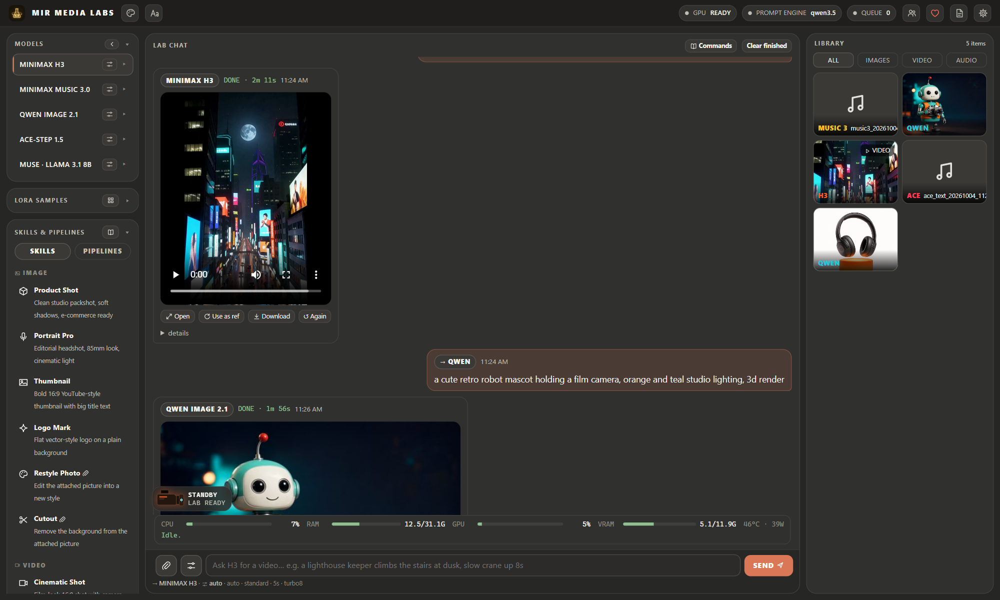
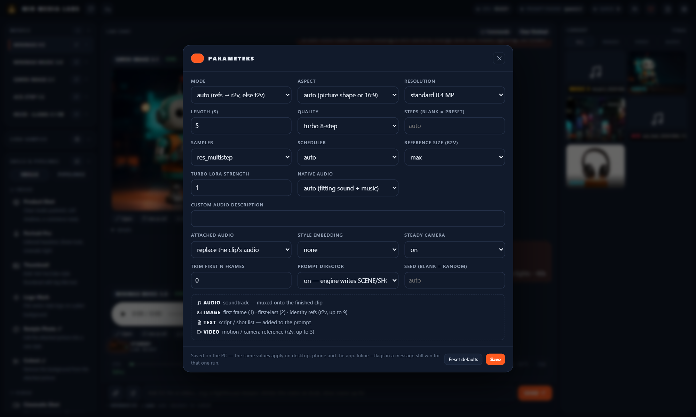
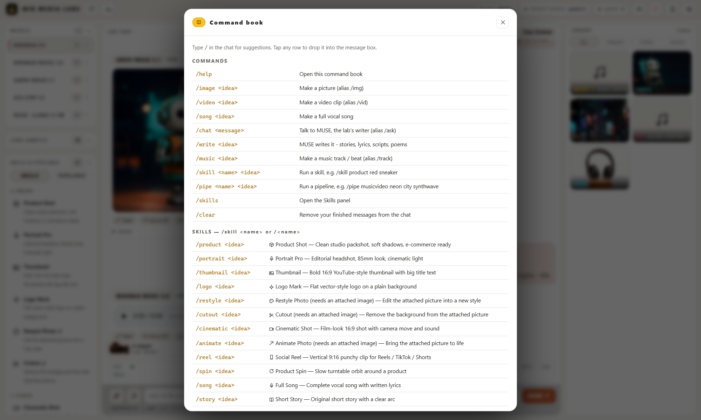
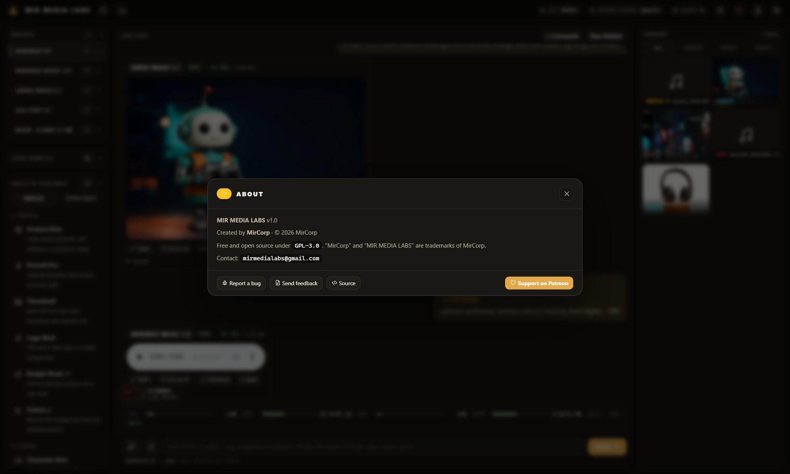
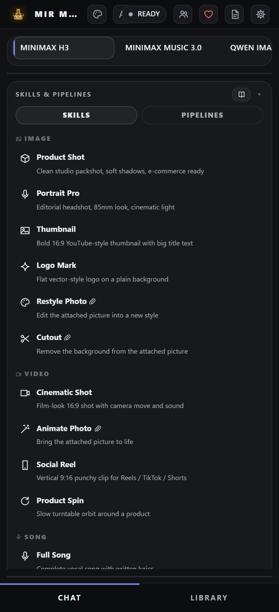

<p align="center"></p>

<h1 align="center">MIR MEDIA LABS</h1>
<p align="center"><b>An independent, open-source AI agent front end for generative models.</b><br>
Describe what you want in plain language. The agent picks the model, writes the prompt, sets the parameters and renders it on <b>your own GPU</b>.<br>
Video, songs, music, images and writing, controlled from your PC, phone or Android TV.</p>

<p align="center">
<a href="../../releases/latest"></a>
<a href="https://www.patreon.com/MirCorp"></a>


</p>

<p align="center"></p>

## Screenshots
| | |
|---|---|
| <br><sub><b>Per-model parameters</b> · Midnight Studio theme</sub> | <br><sub><b>Command book</b> with 21 skills and 5 pipelines · Paper Light theme</sub> |
| <br><sub><b>About · Report a bug · Support</b> · Obsidian Gold theme</sub> | <br><sub><b>Phone browser layout</b> · Graphite theme</sub> |

<sub>Every render shown was made locally by MML on an RTX 5070: the H3 video with audio, the Qwen images, the Music 3 song, the ACE-Step lo-fi track and the MUSE lyrics.</sub>

## Mobile companion: phone and Android TV
MML comes with a **free native Android companion app**. One APK covers phones and Android TV. Your PC does the rendering, and the app gives you the whole studio from the couch or on the go: chat, skills, pipelines, LoRAs, the library and live render progress. The theme you pick follows you to every device.

<p align="center">


</p>
<p align="center"><sub>Chat with a live render · Library · Menu · Paper Light theme · Skills (Midnight Studio)</sub></p>
<p align="center"><br><sub><b>Android TV</b>: the same APK, with a D-pad-friendly layout</sub></p>

**Get it:** download `MirMediaLabs.apk` from the [Releases page](../../releases/latest), or scan the QR code at the end of the Windows setup. Then sign in with the invite from **Host Control**: tap **Scan QR code** and point the phone at the PC, or **Paste invite link**. The app also notices an invite link on your clipboard.

**Why it's useful:**
- It uses your home Wi-Fi when you're there and switches to your remote address when you're away.
- You can **share** photos, clips, songs or text to MML from any app and use them as references.
- Each family member or teammate gets their **own key** and sees only their own creations.

---

## Just say what you want: MUSE Director
You don't need to know which model does what. In **Auto** mode (the default), every message goes to **MUSE**, MML's local AI. MUSE reads the message, any attachments and the last few turns, then decides:

| You type | MUSE does |
|---|---|
| "what's the difference between a verse and a chorus?" | **answers** it (general knowledge, ideas, advice, writing) |
| "a cozy cabin in snowy woods at night" | renders a **picture** |
| "8 second clip of waves on rocks at sunset" | renders a **video with sound** |
| "design a logo for my coffee shop" | runs the **Logo Mark** skill |
| "now animate it" | runs **Animate Photo** and **attaches your last result automatically** |
| "a music video for a synthwave song about neon nights" | runs the **Music Video** pipeline |

- The chat shows what MUSE chose and why. Flags like `--8s` are always kept.
- Slash commands, or picking a model yourself, bypass MUSE whenever you want full control.
- If the AI model is unavailable, a built-in rule engine takes over, so Auto never blocks.

<p align="center"></p>

## Host Control: you decide who gets in
The PC with the GPU is the **host**. Its desktop app (`MirMediaLabs.exe`) has a **Host Control** panel that only exists there:
- **Invite someone:** give each person their own key, shared as a **QR code** or an invite link.
- **Choose what they can use:** Video, Song, Image, Music and/or Chat, plus a **daily request limit** and an **expiry date**.
- **Revoke or restore** access instantly, **issue a new key** (the old one stops working), **stop** someone's running request, or remove them.
- **Pause remote access** with one switch. Phones and other PCs disconnect, and the host keeps working.
- See who is **live right now**, on which devices, and how much they used today, plus an **activity log** of every change.

The server enforces this: access can only be managed from the host PC itself. Even the owner key, used from a phone or another computer, can't change who has access.

<p align="center"></p>

## A media player that fits the studio
Videos and songs play in MML's own themed player on desktop, web, phone and TV:
- the accent colour of the model that made the result
- a scrubber with buffering, time, mute and full screen
- for songs, a **live audio visualizer** that reacts to the music
- the same design in the Android app, with ±10 s skip

<p align="center">


</p>

## Why MIR MEDIA LABS
- **One agent, many models.** You ask for an image, video, song, beat or story. MML routes it to the right engine, so you never deal with node graphs or model-specific settings.
- **Prompts written for you.** A local LLM, the *Prompt director*, rewrites your idea in each model's official prompt style before rendering.
- **Fully local and private.** Everything renders on your machine. No cloud, no subscriptions, no per-render credits, no data collection.
- **Model-agnostic by design.** Skills, pipelines and commands name a *role* (image, video, song, music, writing), never a specific model. When a better model comes out, it slots in behind the same front end.
- **Use it from anywhere in the house.** The PC does the work. Your phone and TV are remotes with the full feature set.

## What it can make
| Role | Engine today | What you get |
|---|---|---|
| **Video** | MiniMax H3 | Video **with native audio**: text-to-video, image-to-video (*animate:*), first + last frame, reference-to-video (identity and motion refs), 4–15 s, vertical, square or widescreen, style presets, an attached soundtrack muxed in |
| **Song** | MiniMax Music 3.0 | Full vocal songs **up to 5 minutes**, from your lyrics or auto-written ones, mood from an image or video reference |
| **Image** | Qwen-Image 2.1 | Text-to-image, **multi-picture edit (up to 10 inputs)**, background removal and cutouts, HD/HQ modes |
| **Music** | ACE-Step 1.5 XL | Fast tracks and beats, **remix, cover and voice swap**, plus BPM, key and strength control |
| **Writing** | MUSE (local Llama 3.1) | MML's writer: chat, stories, lyrics, video scripts, poems, ad copy and prompts, written to feed straight into the other models |

## Features

### Agent console
- A chat-style **Lab chat** where every request becomes a job with a live log, stage and progress
- **Slash commands**: `/image`, `/video`, `/song`, `/music`, `/write`, `/chat`, `/skill`, `/pipe`, `/help` (with a built-in command book)
- **Inline prompt flags**: e.g. `--8s --vertical --hd --seed 42`, `--90s --instrumental`, `--bpm 120 'A minor'`
- **References** for every model: attach images, video, audio or text (paste lyrics or scripts), or share them from your phone's other apps
- **Per-model parameters** (⚙): mode, aspect, resolution, steps, sampler, scheduler, CFG, seed, audio options and more, saved per model
- One-at-a-time **GPU queue** that persists across restarts, with **cancel** and **re-run**

### Skills and pipelines
- **21 one-tap skills** with tuned prompts and settings:
  - **Image:** Product Shot, Portrait Pro, Thumbnail, Logo Mark, Restyle Photo, Cutout
  - **Video:** Cinematic Shot, Animate Photo, Social Reel, Product Spin
  - **Song and music:** Full Song, Instrumental Beat, Jingle, Lo-fi Loop
  - **Writing:** Short Story, Song Lyrics, Video Script, Poem, Ad Copy, Creative Writing, Prompt Writer
- **Multi-model pipelines** that chain renders in one request, with each step's output feeding the next:
  - **Poster → Motion**: design a key image, then animate it
  - **Product Ad**: studio packshot to a vertical 9:16 ad clip
  - **Character Clip**: a portrait that then moves and speaks
  - **Music Video**: song to cover art to a video scored with that song
  - **Album Pack**: a full song plus matching cover art

### LoRA browser
- Browse community LoRAs with sample previews, then **install and apply in one click**
- Optional Civitai key support, and install/remove management

### Library
- Every output is saved with its prompt, model and settings
- Image, video and audio filters, thumbnails, a full-screen viewer, download, **"use as reference"**, and trash

### Desktop app (Windows)
- Native compiled app (`MirMediaLabs.exe`) with its **own taskbar identity**, so you can pin it like any app
- **Live PC performance card**: CPU, RAM, GPU, VRAM, temperature and power, with plain-language bottleneck hints while rendering ("VRAM full", "CPU-bound", "GPU at full speed")
- **Guided installer**:
  - checks GPU, driver, RAM, page file, disk and network
  - **one-click model sets**: Recommended for your GPU (picked from your VRAM), Everything, or Light
  - finds AI models already on your PC and reuses them instead of downloading them again
  - **fast**: models download 3 at a time, *while* the PyTorch runtime installs
  - installs a private Python/PyTorch runtime, the ComfyUI render engine and only the models you pick
  - optionally installs **MUSE (Llama 3.1 8B)** through Ollama. MUSE handles general conversation, builds the prompt for each render model, and picks the model for each request in Auto mode. It never renders: images, video and music always come from the render models.
  - shows a gallery of real MML renders while it works, then a **QR code for the mobile companion**
  - downloads resume, and re-running it offers Modify and Repair
- **Signed auto-updates**: Ed25519-verified manifests, with SHA-256 checks and downgrade protection

<p align="center">


</p>

### Mobile companion app (phone and TV)
- **One APK for phones and Android TV**, with a lightweight native app (plain Java, no frameworks)
- Uses your home Wi-Fi when available and falls back to a remote address
- **Share to MML** from any app (photos, clips, songs, text) to use as references
- Full console, skills, pipelines, LoRAs, library and viewer
- 5 themes and 10 original **MIR FONTS**, synced with the desktop
- **Sign in with an invite**: scan the host's QR code (or a screenshot of it), paste the link, or type it in. If it can't connect, the app explains why and how to fix it, and includes a step-by-step **port-forwarding guide** for using the lab away from home.
- **Push notifications from your own lab**, without Firebase or Google services. You get "your video is ready" with a preview the moment a render finishes, plus messages from the host. Turn on *Instant delivery* to stay connected all the time.
- **Signed self-updates from GitHub Releases** (or from your own lab). Each update has an Ed25519-signed manifest, a SHA-256 check and a signing-certificate match before Android installs it. After the first one, updates install without extra taps on Android 12+.

### Multi-user and security
- **Per-person access keys**: invite family or a team. Each user sees only their own jobs, and the owner sees everything.
- Lockout after repeated wrong keys, security headers, and a sandboxed file system (the app only touches its own folders)
- Isolation audit built in (`/api/isolation`)
- Owner-only machine stats: the performance card is only served to the PC itself

### Design
- Custom **MIR ICONS** and **MIR FONTS** across desktop, web, phone and TV
- An animated studio mascot that shows lab status, plus themes from dark to paper-light

## Download
Get the latest version from the [**Releases page**](../../releases/latest):
- **`MirMediaLabs-Setup.exe`**: the Windows host (installer and app)
- **`MirMediaLabs.apk`**: the Android phone and TV remote, signed by MirCorp
- **`SHA256SUMS.txt`**: checksums. Verify with `certutil -hashfile MirMediaLabs-Setup.exe SHA256`.

Only download from this repository. Windows SmartScreen may warn about the unsigned installer: click **More info > Run anyway**.

## Requirements
- **PC:** Windows 10/11 with an NVIDIA GPU. The setup wizard checks your GPU, RAM and disk space before installing anything.
- **Phone/TV:** Android 7.0 or later, on the same network as the PC (or via your own remote address)

## Quick start
1. Run **`MirMediaLabs-Setup.exe`**, pick your models, and let it install.
2. Open **MIR MEDIA LABS** from the desktop or Start menu, then pin it to the taskbar if you like.
3. Type an idea, e.g. `/video a neon city at night, slow drone shot --vertical`, or tap a **Skill**.
4. **Phone/TV:** install the APK. On the PC open **Host Control > Invite someone**, then scan the QR code with the app (or paste the link). To use it away from home, add your address under **Host Control > Phones** (port-forwarding steps are in the app).

## Run from source
```
cd server
pip install flask requests
python medialab.py        # http://127.0.0.1:5400
```
Rendering needs a local [ComfyUI](https://github.com/comfyanonymous/ComfyUI) with the models installed. MUSE (chat, prompt building and the Auto-mode model picker) needs [Ollama](https://ollama.com) with `llama3.1:8b`.
Android: open `app/` in Android Studio, or run `powershell -File build_apk.ps1`.

## Support development
MIR MEDIA LABS is free and always will be. If it's useful to you, please support it on **[Patreon](https://www.patreon.com/MirCorp)**. Your support funds new models, features and testing hardware. You can also use the **Support** button inside the app.

## Feedback and bugs
- In the app: **About > Report a bug** or **Send feedback**
- Email: **mirmedialabs@gmail.com**
- Or [open an issue](../../issues/new/choose). For security issues, see [SECURITY.md](SECURITY.md).

## License and ownership
Copyright (C) 2026 **MirCorp**. Licensed under the [GNU GPL v3.0](LICENSE): you may use, study, modify and share the code, but modified versions you distribute must also be open source under GPL-3.0.

"MirCorp" and "MIR MEDIA LABS" are trademarks of MirCorp. See [TRADEMARK.md](TRADEMARK.md), [NOTICE](NOTICE) and [PRIVACY.md](PRIVACY.md).

AI models (MiniMax, Qwen, ACE-Step, Llama, ComfyUI) are third-party works, downloaded separately and subject to their own licenses.
