<p align="center"></p>

<h1 align="center">MIR MEDIA LABS</h1>
<p align="center"><b>An independent, open-source AI media studio that runs on your own GPU.</b><br>
Describe what you want in plain language. MUSE, the lab's agent, picks the model, writes the prompt, sets the parameters and renders it on <b>your own PC</b>.<br>
Video with sound, full songs, music, images and writing, plus a timeline editor, a kids-series studio, a downloader and a social-media desk. Control it from your PC, phone, tablet or Android TV.</p>

<p align="center">
<a href="../../releases/latest"></a>
<a href="https://www.patreon.com/cw/MirCorp"></a>


</p>

<p align="center"><a href="docs/promo/mml-promo.mp4">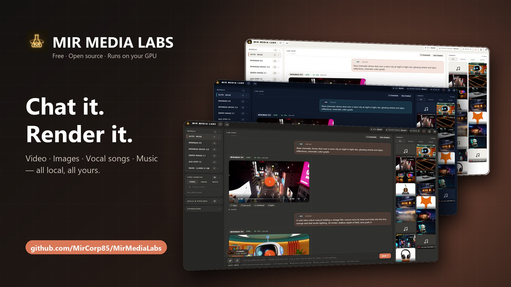</a></p>

<p align="center"><b><a href="docs/promo/mml-promo.mp4">▶ Watch the 42-second promo video</a></b> · every clip (MiniMax H3) and the soundtrack (ACE-Step) was rendered by MML itself on one RTX 5070</p>

<p align="center">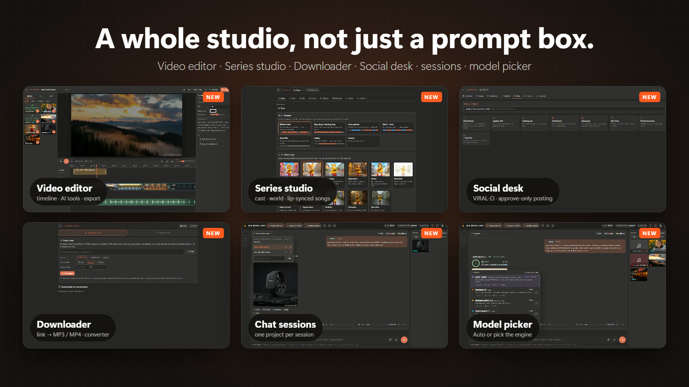</p>

## Contents
- [What it can make](#what-it-can-make)
- [Just say what you want: MUSE Director](#just-say-what-you-want-muse-director)
- [The studios: Video editor · Series studio · Downloader](#the-studios)
- [Social desk and the VIRAL-Ω agent](#social-desk-and-the-viral-ω-agent)
- [Chat sessions, model picker and settings you can understand](#chat-sessions-model-picker-and-settings-you-can-understand)
- [Mobile companion: phone, tablet and Android TV](#mobile-companion-phone-tablet-and-android-tv)
- [Host Control: you decide who gets in](#host-control-you-decide-who-gets-in)
- [Full feature list](#full-feature-list)
- [Download](#download) · [Requirements](#requirements) · [Quick start](#quick-start) · [Run from source](#run-from-source)

## What it can make
| Role | Engine today | What you get |
|---|---|---|
| **Video** | MiniMax H3 | Video **with native audio**: text-to-video, image-to-video (*animate:*), first + last frame, reference-to-video (identity and motion refs), 4–15 s per clip, **extend** into longer shots, **storyboards** with a prompt per segment, **lip-synced singing** to a song, vertical, square or widescreen, camera moves, style presets and post effects |
| **Song** | MiniMax Music 3.0 | Full vocal songs **up to 5 minutes**, from your lyrics or auto-written ones, mood from an image or video reference |
| **Image** | Qwen-Image 2.1 | Text-to-image, **multi-picture edit (up to 10 inputs)**, background removal and cutouts, HD/HQ modes |
| **Music** | ACE-Step 1.5 XL | Fast tracks and beats, **remix, cover and voice swap**, plus BPM, key and strength control |
| **Writing** | MUSE (local Gemma 4 12B) | MML's writer: chat, stories, lyrics, video scripts, poems, ad copy and prompts, written to feed straight into the other models |

Models are a **role**, not a hard-coded dependency. Skills, pipelines, the studios and the commands all ask for "image", "video", "song", "music" or "writing", so a better model can slot in behind the same front end.

## Screenshots
<p align="center">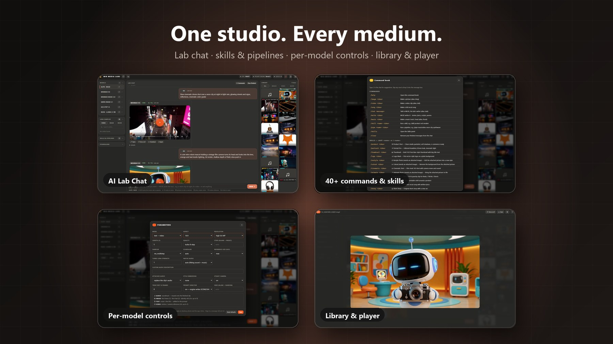</p>

| | |
|---|---|
| 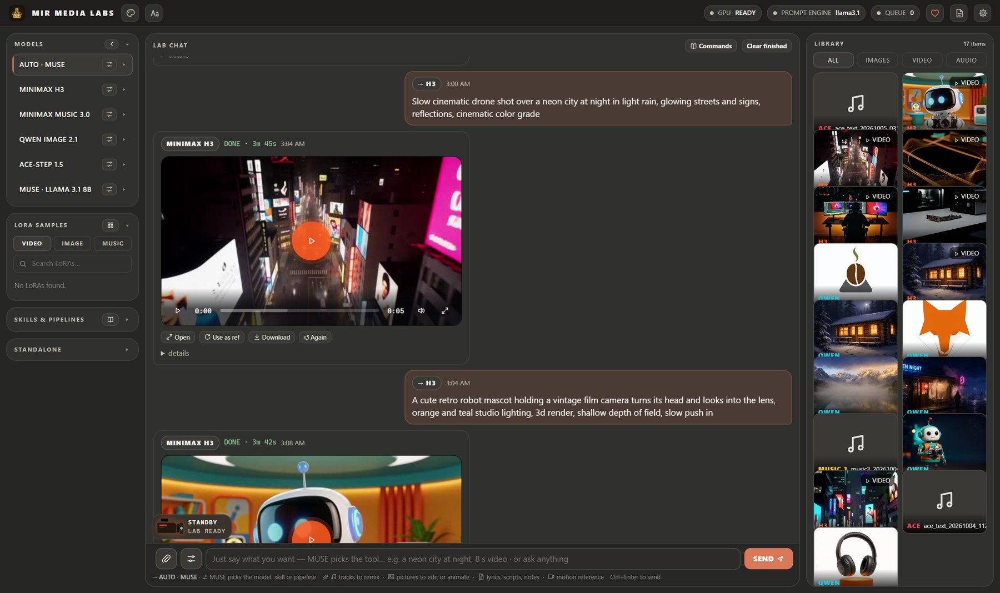<br><sub><b>Lab chat</b>: MUSE picks the model, H3 renders the clip · Claude Dark theme</sub> | 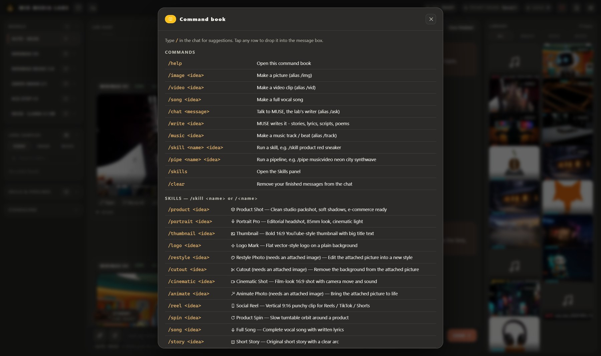<br><sub><b>Command book</b>: commands, skills and pipelines</sub> |
| 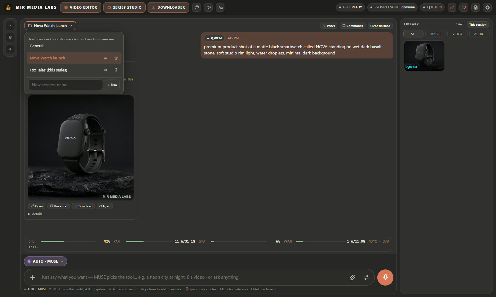<br><sub><b>Chat sessions</b>: every project keeps its own chat and media</sub> | 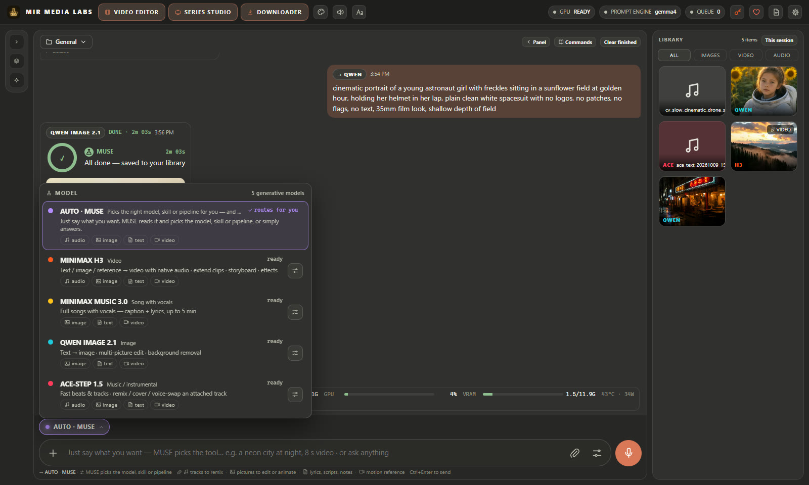<br><sub><b>Model picker</b>: Auto, or pick the engine yourself (Alt+M)</sub> |
| 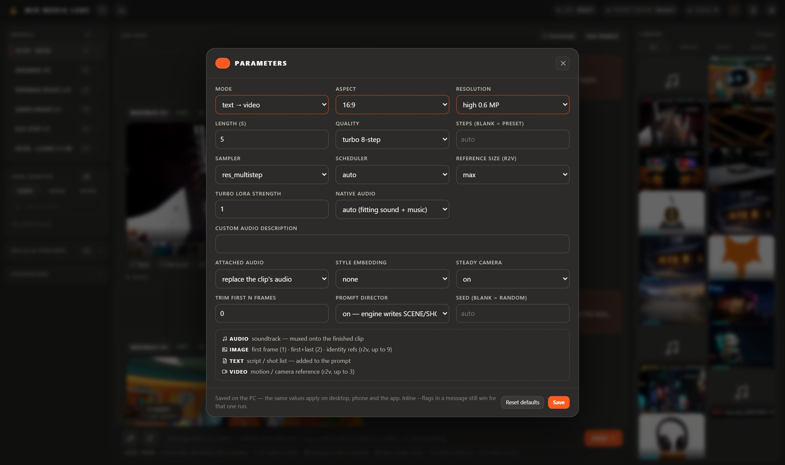<br><sub><b>Per-model parameters</b> (MiniMax H3)</sub> | 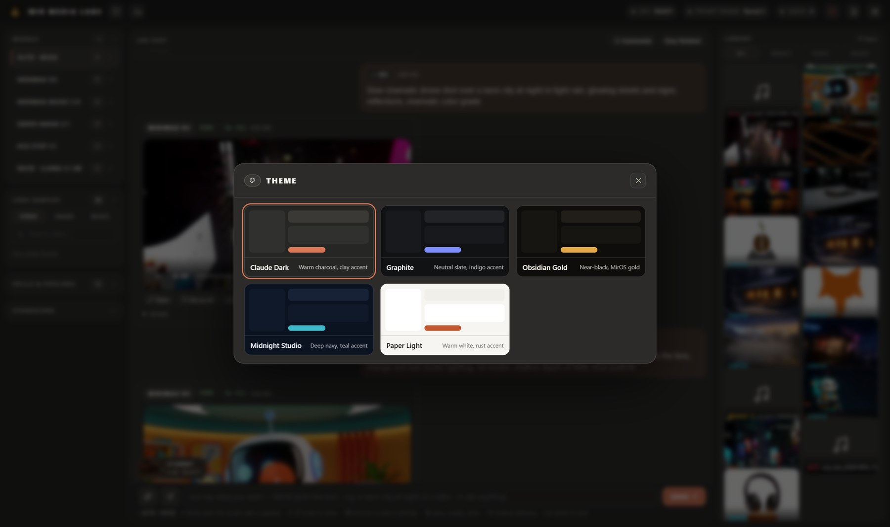<br><sub><b>5 themes</b>: Claude Dark, Graphite, Obsidian Gold, Midnight Studio, Paper Light</sub> |

<p align="center">
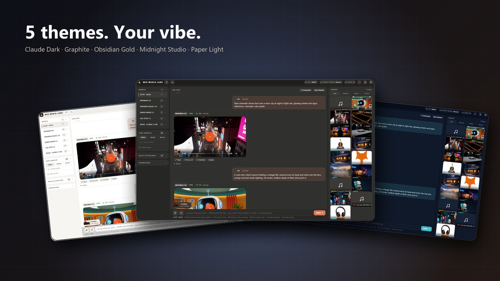
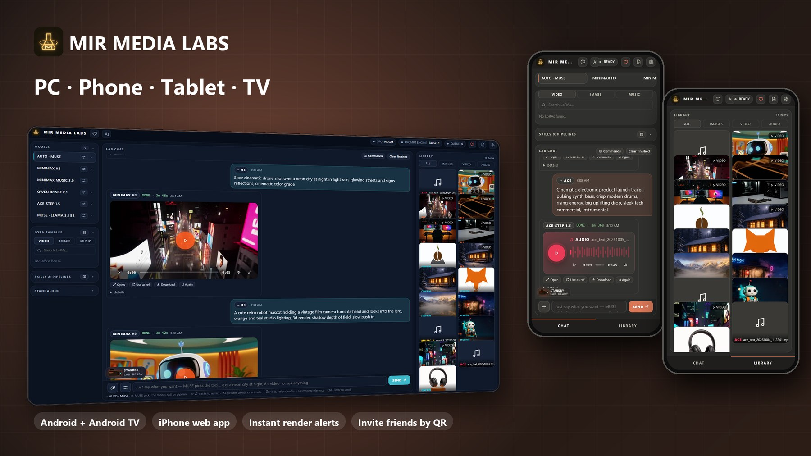
</p>

<sub>Every render shown was made locally by MML on an RTX 5070: the H3 video with audio, the Qwen images, the Music 3 song, the ACE-Step tracks and the MUSE lyrics.</sub>

---

## Just say what you want: MUSE Director
You don't need to know which model does what. In **Auto** mode (the default), every message goes to **MUSE**, MML's AI. MUSE reads the message, any attachments and the last few turns of the current session, then decides:

| You type | MUSE does |
|---|---|
| "what's the difference between a verse and a chorus?" | **answers** it (general knowledge, ideas, advice, writing) |
| "a cozy cabin in snowy woods at night" | renders a **picture** |
| "8 second clip of waves on rocks at sunset" | renders a **video with sound** |
| "design a logo for my coffee shop" | runs the **Logo Mark** skill |
| "now animate it" | runs **Animate Photo** and **attaches your last result automatically** |
| "a music video for a synthwave song about neon nights" | runs the **Music Video** pipeline |

- The chat shows what MUSE chose and why. Flags like `--8s` are always kept.
- Slash commands, or picking a model yourself, bypass MUSE whenever you want full control.
- If the AI model is unavailable, a built-in rule engine takes over, so Auto never blocks.
- **Prompts written for you:** before rendering, MUSE rewrites your idea in each model's own prompt style (from the official prompting guides), and links attachments into the prompt ("the woman in picture 1") so references are actually used.
- **Live status bubble:** every job shows a ring dial with a segment per step, one live line of what the engine is doing right now, and a step timeline. No guessing whether it's stuck.
- **MUSE can talk:** replies can be read aloud by a natural local voice (Kokoro, runs on the CPU). It speaks on the device that asked, and **Listen** plays any reply.
- **Optional cloud brain (owner only):** MUSE runs locally by default. The owner can plug in their *own* API key for Claude, GPT or GLM to power chat, the Director and the prompt writer, with a monthly spending cap. Renders always stay on your GPU, and invited users always stay on the local model.

<p align="center">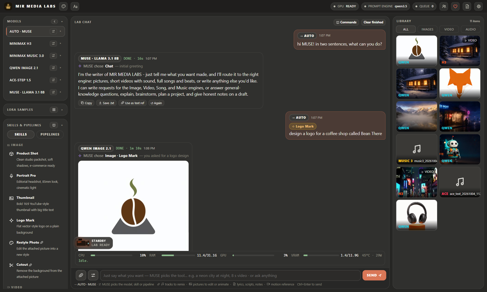</p>

## The studios
Three bigger tools have their own labelled tabs in every version of the lab (desktop, web, phone and tablet).

### Video editor
A multi-track **timeline editor** built into the lab.
- Drag clips, songs and pictures from the library onto video and audio tracks, then trim, split, move, fade, change speed and volume, and add titles and text.
- A smooth preview that follows the playing media, so audio and picture stay in sync while you scrub.
- **AI tools on the timeline:** grab a frame or a cut and send it back to the lab ("extend this shot", "restyle this frame"). The result lands back on the timeline.
- Renders the final cut with ffmpeg into the library, ready to share or to post from the Social desk.
- Open any video from the library viewer with **Edit**.

<p align="center">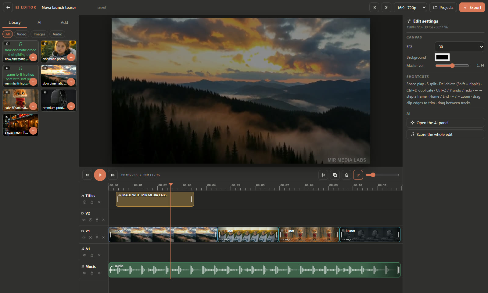</p>

### Series studio
Plan and produce a **kids-animation series**, episode by episode, with consistent characters.
- **Style bible:** 11 visual styles and 7 episode structures, each with a preview.
- **Cast:** a 25-field character builder (kind, age, look, outfit, voice and more) that draws a hero image, a **turnaround sheet** and an **expressions sheet** for every character. You can also start a character from a photo or from your library.
- **World:** locations with a turnaround and three extra views (3D cutaway, opposite-corner cutaway, top view), plus an **object builder** for props that stay the same in every shot.
- **Episodes:** the writer plans the shots. Each shot gets a keyframe and a video clip, cut or continued from the last frame of the previous shot, then everything is assembled with frame-exact joins and optional soft cross-fades.
- **Songs that the characters actually sing:** write or upload a song. MML splits the vocals and words, and H3 renders each shot **to the vocal**, so mouths move with the lyrics.
- A background runner does the whole episode for you. It survives restarts, retries a failed step once, and lets you cancel, skip or resume any step.
- Every option has a plain description and a picture, clip or audio preview.

<p align="center">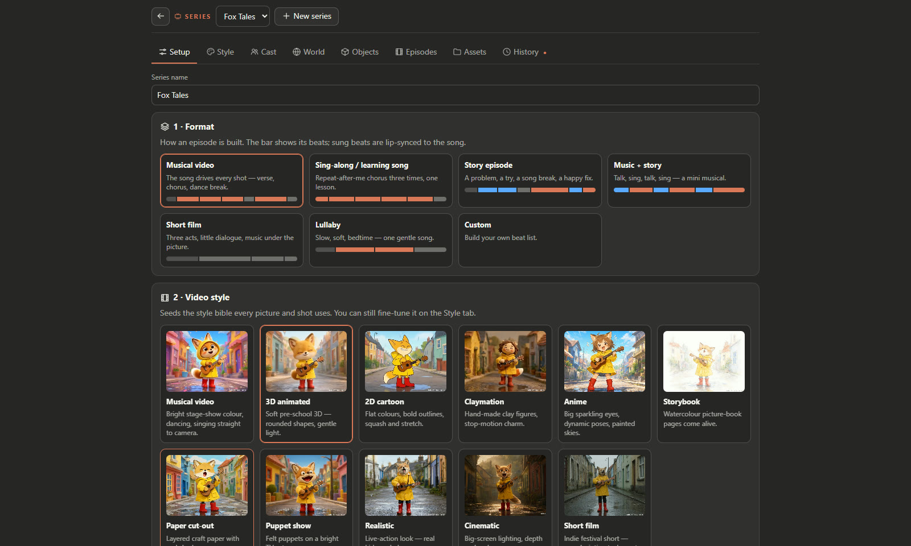</p>

### Downloader and converter
- Paste a link (YouTube and most video sites, via yt-dlp) and get **MP3, video, or both**, with a quality setting, optional trim and still frames.
- **Convert** any file in your library or from your PC to MP3, M4A, WAV or MP4.
- Results go straight into the library. From there they become references, editor clips or Series songs.

<p align="center">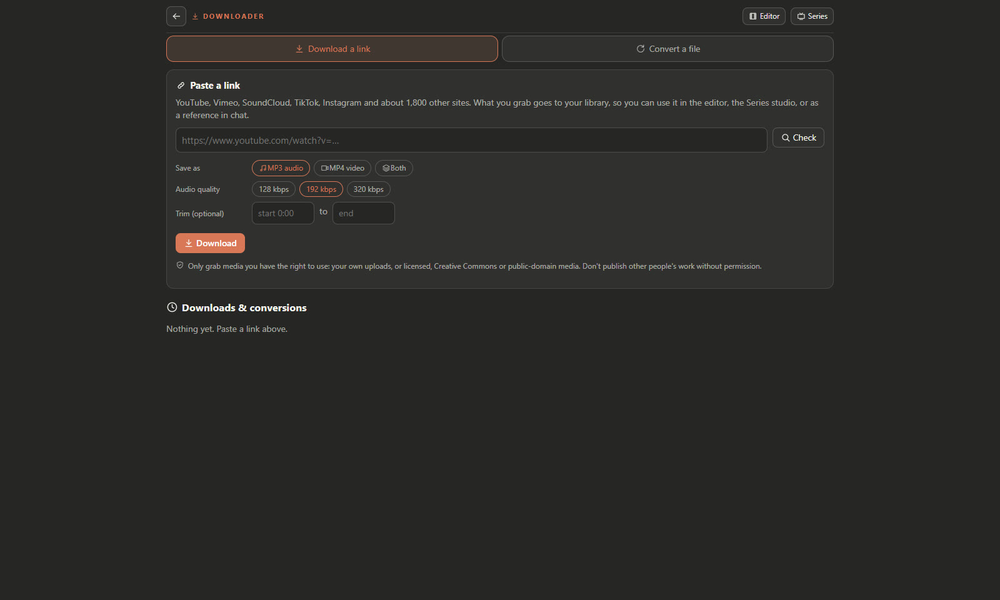</p>

## Social desk and the VIRAL-Ω agent
A built-in desk for running your creator accounts: **Instagram, YouTube and TikTok**.
- **Overview, Queue, Scheduled and Analytics** (follower trend, reach and engagement charts per post).
- **VIRAL-Ω**, a growth agent that studies what works, suggests what to post, writes captions, hashtags and hooks, and turns an idea into a lab render with one tap. A finished render can go straight into the queue as a draft.
- **8 social skills**: Hook Doctor, Caption A/B, Hashtag Lab, Trend Scout, Repurpose, Best Time and more.
- **Approve-only publishing:** nothing is ever posted without your explicit approval. The server refuses to publish a post that hasn't been approved, whoever asks.
- TikTok posts follow TikTok's own rules: privacy, comments, duet, stitch, disclosure and the AI-generated label are set per post before approval.

<p align="center">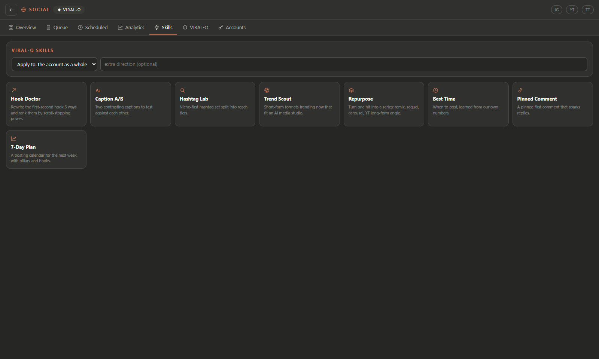</p>

## Chat sessions, model picker and settings you can understand
- **Sessions = projects.** Each session keeps its own chat **and** its own library media. Rename, delete (the media moves to *General*, nothing is lost) and move any file between sessions from the viewer. The library can show *This session* or *All*.
- **Model picker:** one chip in the composer opens the picker (Alt+M): Auto, Video (H3), Song (Music 3), Image (Qwen) or Music (ACE). Long-press it on the phone for that model's parameters.
- **Settings in plain language:** every ⚙ option has a plain name, the technical term next to it, and a one-line description of what it changes. Most options have a **preview tile**: hover or tap to see what that camera move, look or effect does before you spend a render on it. Advanced fields sit in their own "leave as is" group.
- **Power tools for video:** extend a clip into a longer shot, storyboard with a prompt per segment, post effects (grade, grain, vignette, sharpen, fades, frame interpolation, upscale, boomerang, speed), and **your own ComfyUI workflows** with `{{prompt}}`, `{{seed}}` and `{{image1}}` placeholders.
- The library viewer has previous/next (arrows, keys or swipe), and chat bubbles show thumbnails of the references you attached.

<p align="center">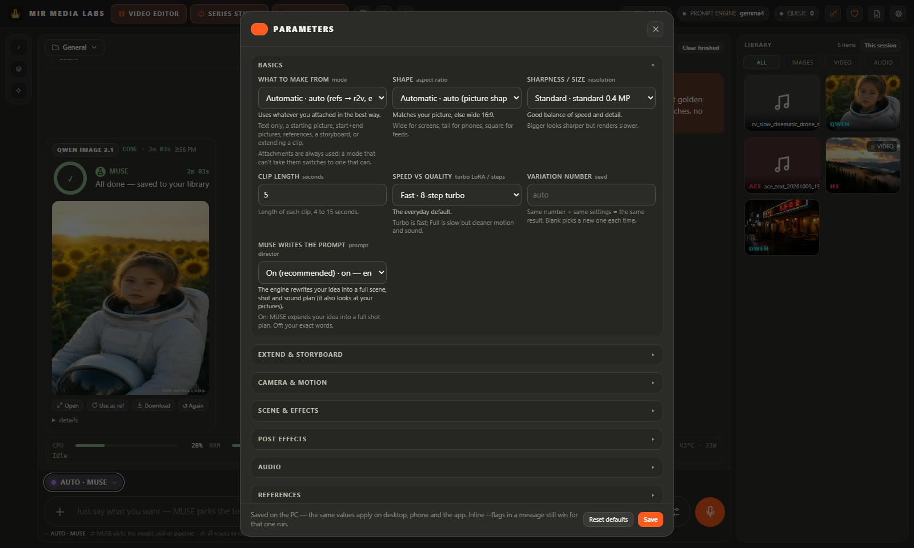</p>

## Mobile companion: phone, tablet and Android TV
MML comes with a **free native Android companion app**. One APK covers phones, tablets and Android TV. Your PC does the rendering, and the app gives you the whole studio from the couch or on the go: chat, sessions, skills, pipelines, LoRAs, the library, the studios, the Social desk and live render progress. The theme you pick follows you to every device.

<p align="center">
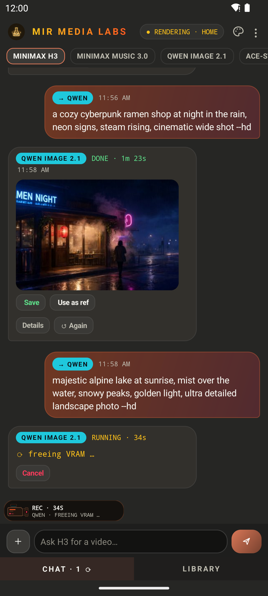
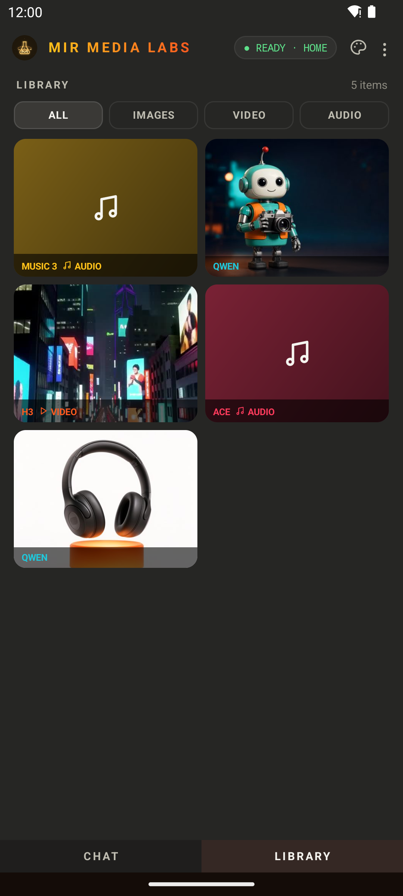
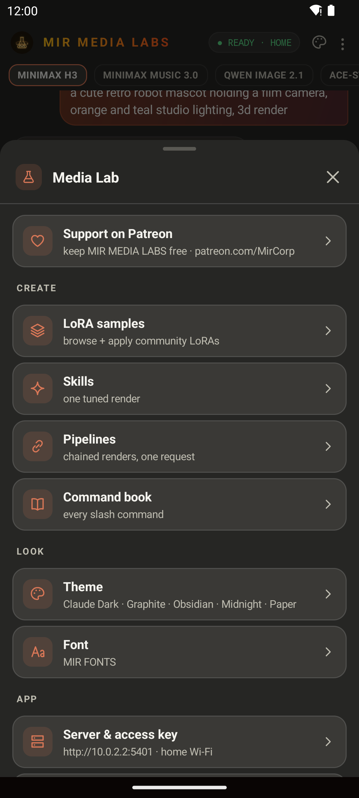
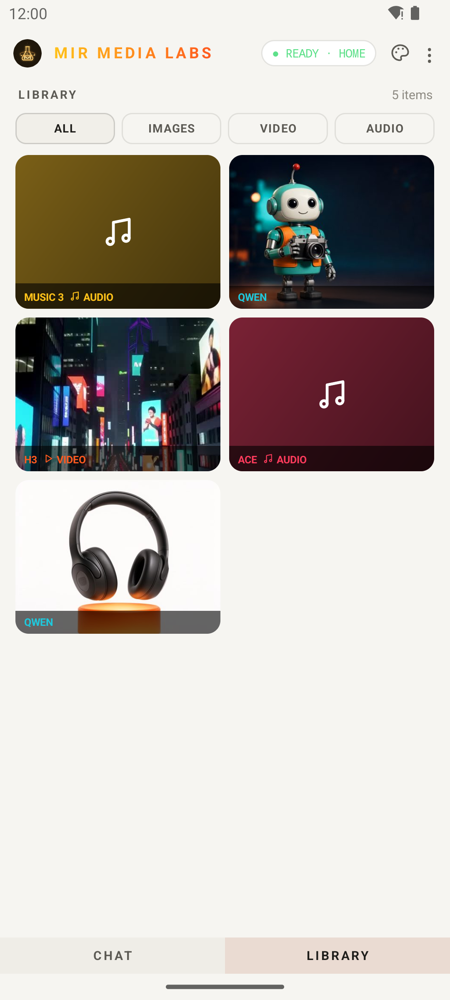
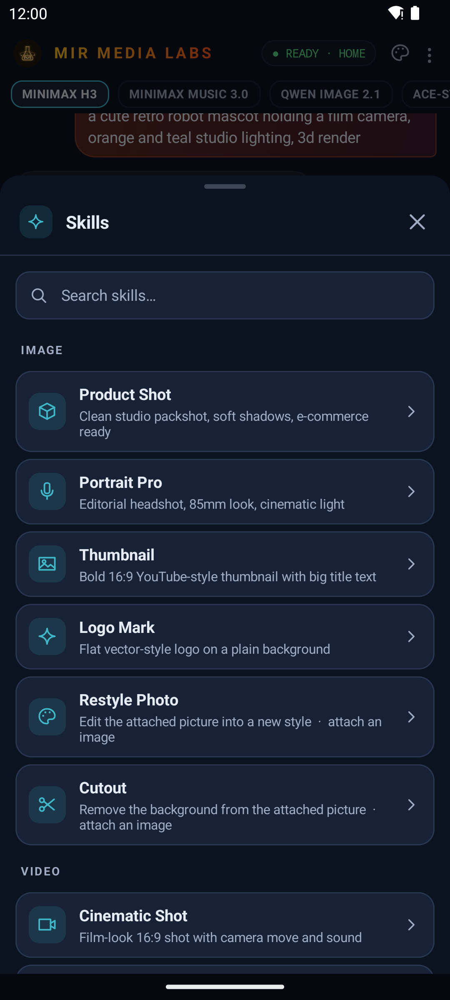
</p>
<p align="center"><sub>Chat with a live render · Library · Menu · Paper Light theme · Skills (Midnight Studio)</sub></p>
<p align="center">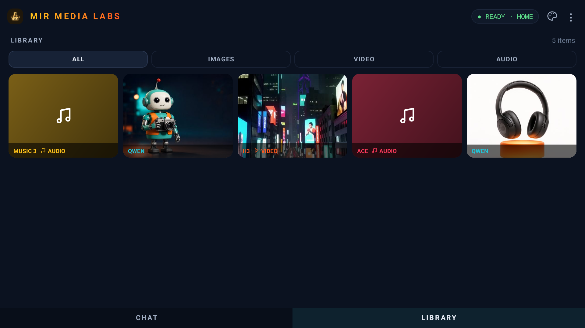<br><sub><b>Android TV</b>: the same APK, with a D-pad-friendly layout</sub></p>
<p align="center">
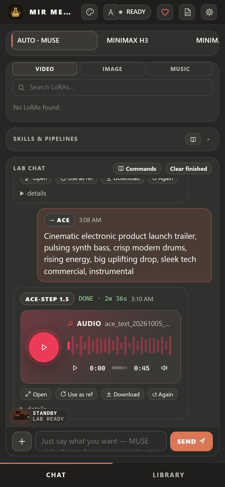
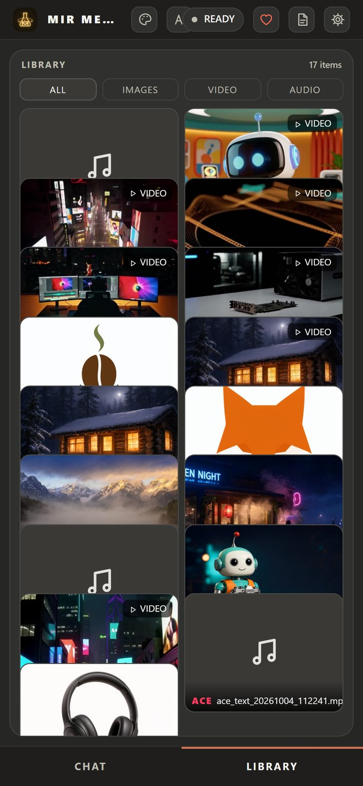
<br><sub>No app? The full lab also works in the phone's browser.</sub>
</p>

**Get it:** download `MirMediaLabs.apk` from the [Releases page](../../releases/latest), or scan the QR code at the end of the Windows setup. Then sign in with the invite from **Host Control**: tap **Scan QR code** and point the phone at the PC, or **Paste invite link**. The app also notices an invite link on your clipboard.

**Why it's useful:**
- It uses your home Wi-Fi when you're there and switches to your remote address when you're away. A connection doctor explains any problem and includes a port-forwarding guide.
- **Tablet mode** puts models and tools, the chat and the library side by side.
- **Push notifications from your own lab**, with no Firebase or Google services: "your video is ready" with a preview, plus messages from the host.
- You can **share** photos, clips, songs or text to MML from any app and use them as references.
- Each family member or teammate gets their **own key** and sees only their own creations.

## Host Control: you decide who gets in
The PC with the GPU is the **host**. Its desktop app (`MirMediaLabs.exe`) has a **Host Control** panel that only exists there:
- **Invite someone:** give each person their own key, shared as a **QR code** or an invite link.
- **Choose what they can use:** which engines (Video, Song, Image, Music, Chat) and which features (attachments, pipelines, LoRAs, advanced settings, extend, custom workflows, downloader), plus a **daily request limit** and an **expiry date**. New invites start with a safe minimum.
- **One device per key:** an invited key locks to the first device that uses it. **Reset device** frees it. Only the owner's master key works on several devices, and it is only ever shown on the host PC.
- **Revoke or restore** access instantly, **issue a new key** (the old one stops working), **stop** someone's running request, or remove them.
- **Pause remote access** with one switch. Phones and other PCs disconnect, and the host keeps working.
- See who is **live right now**, on which devices, and how much they used today, plus an **activity log** of every change.

The server enforces this: access can only be managed from the host PC itself. Even the owner key, used from a phone or another computer, can't change who has access.

<p align="center">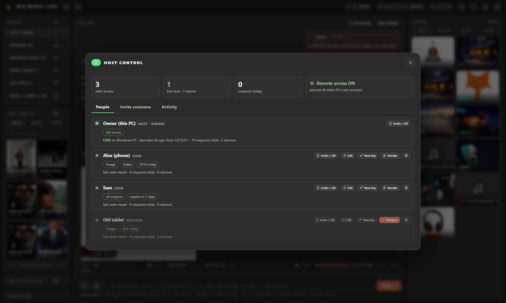</p>

## A media player that fits the studio
Videos and songs play in MML's own themed player on desktop, web, phone and TV:
- the accent colour of the model that made the result
- a scrubber with buffering, time, mute and full screen
- for songs, a **live audio visualizer** that reacts to the music
- the same design in the Android app, with ±10 s skip

<p align="center">
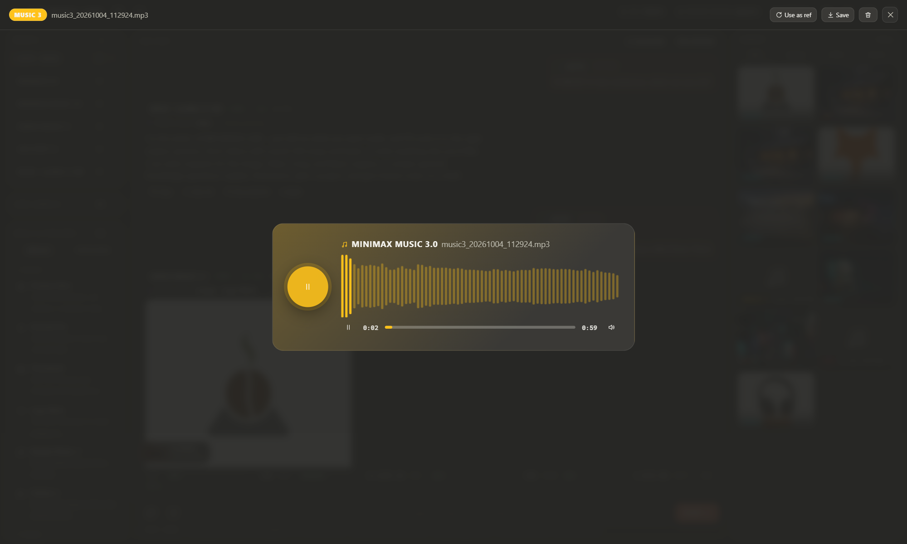
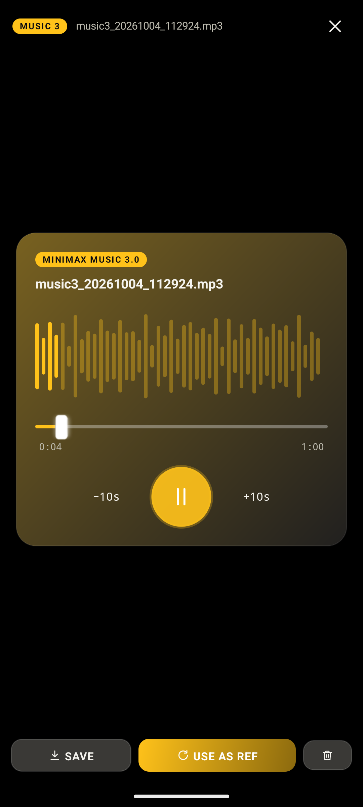
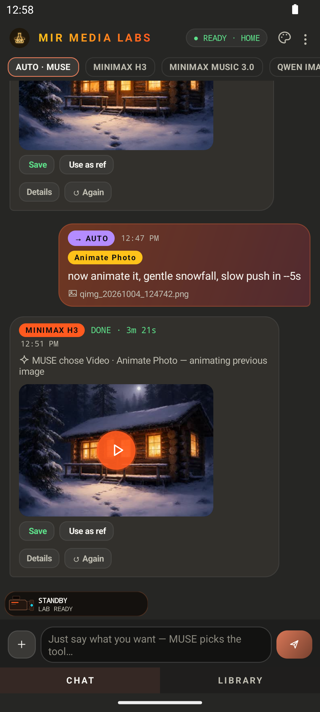
</p>

## Why MIR MEDIA LABS
- **One agent, many models.** You ask for an image, video, song, beat or story. MML routes it to the right engine, so you never deal with node graphs or model-specific settings.
- **A whole studio, not just a prompt box.** Edit, plan a series, download sources, schedule posts, and keep every project in its own session.
- **Fully local and private.** Everything renders on your machine. No subscriptions, no per-render credits, no data collection. A cloud brain is strictly optional and uses your own key.
- **Model-agnostic by design.** When a better model comes out, it slots in behind the same front end.
- **Use it from anywhere in the house.** The PC does the work. Your phone, tablet and TV are remotes with the full feature set.

## Full feature list

### Agent console
- A chat-style **Lab chat** where every request becomes a job with a live status bubble, log, stage and progress
- **Chat sessions** (projects) with their own chat and media
- **Slash commands**: `/image`, `/video`, `/song`, `/music`, `/write`, `/chat`, `/skill`, `/pipe`, `/help` (with a built-in command book)
- **Inline prompt flags**: e.g. `--8s --vertical --hd --seed 42`, `--90s --instrumental`, `--bpm 120 'A minor'`
- **References** for every model: attach images, video, audio or text (paste lyrics or scripts), or share them from your phone's other apps. Thumbnails show in the chat.
- **Per-model parameters** (⚙) with plain-language descriptions and previews, saved per model
- One-at-a-time **GPU queue** that persists across restarts, with **cancel** and **re-run**
- A small **"MIR MEDIA LABS" watermark** on renders (can be turned off by the owner)

### Skills and pipelines
- **21 one-tap skills** with tuned prompts and settings:
  - **Image:** Product Shot, Portrait Pro, Thumbnail, Logo Mark, Restyle Photo, Cutout
  - **Video:** Cinematic Shot, Animate Photo, Social Reel, Product Spin
  - **Song and music:** Full Song, Instrumental Beat, Jingle, Lo-fi Loop
  - **Writing:** Short Story, Song Lyrics, Video Script, Poem, Ad Copy, Creative Writing, Prompt Writer
- **Multi-model pipelines** that chain renders in one request, with each step's output feeding the next:
  - **Poster → Motion**: design a key image, then animate it
  - **Product Ad**: studio packshot to a vertical 9:16 ad clip
  - **Character Clip**: a portrait that then moves and speaks
  - **Music Video**: song to cover art to a video scored with that song
  - **Album Pack**: a full song plus matching cover art

### Studios
- **Video editor**: multi-track timeline, trims, fades, volume, AI frame/cut tools, ffmpeg export to the library
- **Series studio**: style bible, cast with turnarounds and expressions, world and objects, episode planning, lip-synced songs, auto-resuming episode runner
- **Downloader and converter**: link to MP3/MP4 (yt-dlp), file conversion, straight into the library
- **Social desk**: Instagram, YouTube and TikTok, analytics, the VIRAL-Ω growth agent, approve-only publishing

### LoRA browser
- Browse community LoRAs with sample previews, then **install and apply in one click**
- MML checks each LoRA against your installed model, marks the ones that won't load, and every result shows which LoRAs were applied
- Optional Civitai key support, and install/remove management

### Library
- Every output is saved with its prompt, model and settings, in its session
- Image, video and audio filters, thumbnails, a full-screen viewer that fits any resolution (tap for 1:1), previous/next, download, **"use as reference"**, **Edit**, move to another session, and trash

### Desktop app (Windows)
- Native compiled app (`MirMediaLabs.exe`) with its **own taskbar identity**, so you can pin it like any app
- **Live PC performance card**: CPU, RAM, GPU, VRAM, temperature and power, with plain-language bottleneck hints while rendering ("VRAM full", "CPU-bound", "GPU at full speed")
- **Guided installer**:
  - checks GPU, driver, RAM, page file, disk and network
  - **one-click model sets**: Recommended for your GPU (picked from your VRAM), Everything, or Light
  - finds AI models already on your PC and reuses them instead of downloading them again
  - **fast**: models download 3 at a time, *while* the PyTorch runtime installs
  - installs a private Python/PyTorch runtime, the ComfyUI render engine, the MUSE voice and only the models you pick
  - optionally installs **MUSE (Gemma 4 12B)** through Ollama. MUSE handles general conversation, builds the prompt for each render model, and picks the model for each request in Auto mode. It never renders: images, video and music always come from the render models.
  - shows a gallery of real MML renders while it works, then a **QR code for the mobile companion**
  - downloads resume, and re-running it offers Modify and Repair
- Every preview and sample ships inside the installer, so nothing is fetched at runtime
- Optional **HTTPS** for remote access with a free Let's Encrypt certificate that renews itself
- **Signed auto-updates**: Ed25519-verified manifests, with SHA-256 checks and downgrade protection

<p align="center">
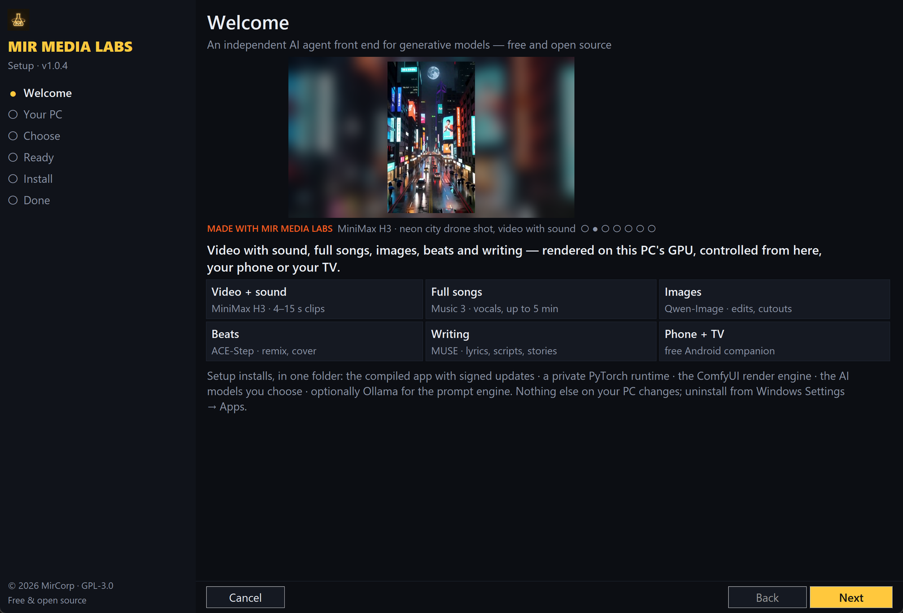
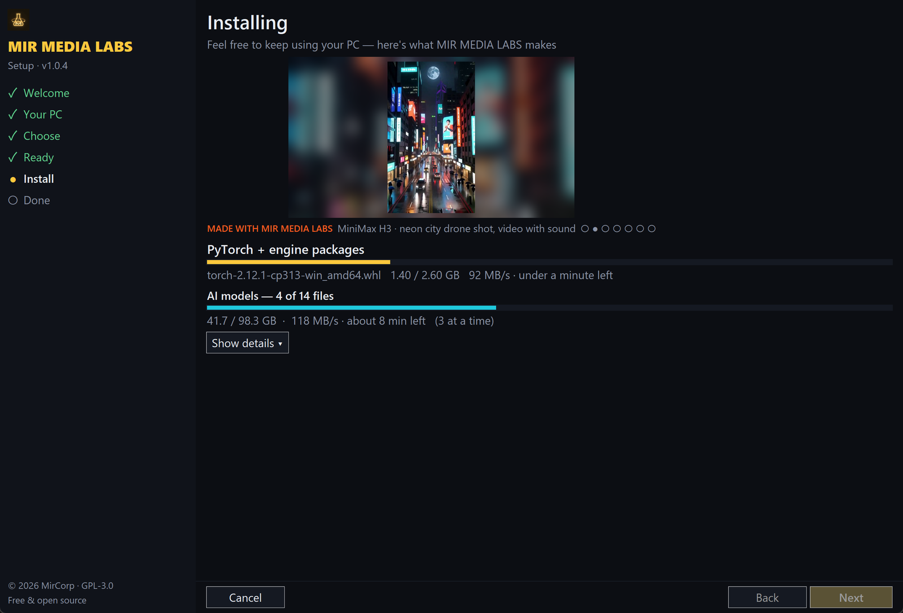
</p>

### Linux (beta)
- AMD-first port (ROCm, with NVIDIA/CUDA also supported): `linux/install.sh` sets up a headless ComfyUI, Ollama and the models, with start/stop scripts and the same signed updates
- Minimum: 12 GB VRAM and 32 GB RAM. Cards that can't run the NVIDIA-only H3 text encoder get an int8 encoder automatically.
- Early: tested for logic, not yet on many real machines. Bug reports are very welcome.

### Mobile companion app (phone, tablet and TV)
- **One APK for phones, tablets and Android TV**, with a lightweight native app (plain Java, no frameworks)
- Uses your home Wi-Fi when available and falls back to a remote address
- **Share to MML** from any app (photos, clips, songs, text) to use as references
- Full console, sessions, skills, pipelines, LoRAs, library, viewer, the three studios and the Social desk
- 5 themes and 10 original **MIR FONTS**, synced with the desktop
- **Sign in with an invite**: scan the host's QR code (or a screenshot of it), paste the link, or type it in. If it can't connect, the app explains why and how to fix it, and includes a step-by-step **port-forwarding guide** for using the lab away from home.
- **Push notifications from your own lab**, without Firebase or Google services. Turn on *Instant delivery* to stay connected all the time.
- **Signed self-updates from GitHub Releases** (or from your own lab). Each update has an Ed25519-signed manifest, a SHA-256 check and a signing-certificate match before Android installs it. After the first one, updates install without extra taps on Android 12+.

### Multi-user and security
- **Per-person access keys** with per-engine and per-feature permissions, daily limits and expiry. Each user sees only their own jobs and media, and the owner sees everything.
- **One device per invited key**; the master key is only ever shown on the host PC
- Lockout after repeated wrong keys, security headers, and a sandboxed file system (the app only touches its own folders)
- Isolation audit built in (`/api/isolation`)
- Owner-only machine stats and cloud-brain settings: they are only served to the PC itself, and API keys are never sent back to any screen

### Design
- Custom **MIR ICONS** and **MIR FONTS** across desktop, web, phone and TV
- 5 themes from dark to paper-light

## Download
Get the latest version from the [**Releases page**](../../releases/latest):
- **`MirMediaLabs-Setup.exe`**: the Windows host (installer and app)
- **`MirMediaLabs.apk`**: the Android phone, tablet and TV remote, signed by MirCorp
- **`SHA256SUMS.txt`**: checksums. Verify with `certutil -hashfile MirMediaLabs-Setup.exe SHA256`.

Only download from this repository. Windows SmartScreen may warn about the unsigned installer: click **More info > Run anyway**.

## Requirements
- **PC:** Windows 10/11 with an NVIDIA GPU (12 GB VRAM recommended for video). The setup wizard checks your GPU, RAM and disk space before installing anything.
- **Linux (beta):** AMD or NVIDIA GPU with 12 GB VRAM, 32 GB RAM
- **Phone/TV:** Android 7.0 or later, on the same network as the PC (or via your own remote address)

## Quick start
1. Run **`MirMediaLabs-Setup.exe`**, pick your models, and let it install.
2. Open **MIR MEDIA LABS** from the desktop or Start menu, then pin it to the taskbar if you like.
3. Type an idea, e.g. `/video a neon city at night, slow drone shot --vertical`, or tap a **Skill**.
4. Start a **session** for each project from the folder chip at the top of the chat, and open the **Editor**, **Series** or **Downloader** tabs when you need them.
5. **Phone/TV:** install the APK. On the PC open **Host Control > Invite someone**, then scan the QR code with the app (or paste the link). To use it away from home, add your address under **Host Control > Phones** (port-forwarding steps are in the app).

## Run from source
```
cd server
pip install flask requests "yt-dlp[default]"
python medialab.py        # http://127.0.0.1:5400
```
Rendering needs a local [ComfyUI](https://github.com/comfyanonymous/ComfyUI) with the models installed. MUSE (chat, prompt building and the Auto-mode model picker) needs [Ollama](https://ollama.com) with `gemma4:12b`. The video editor and downloader need [ffmpeg](https://ffmpeg.org).
Linux: `linux/install.sh`. Android: open `app/` in Android Studio, or run `powershell -File build_apk.ps1`.

## Support development
MIR MEDIA LABS is free and always will be. If it's useful to you, please support it on **[Patreon](https://www.patreon.com/cw/MirCorp)**: **$3 Supporter** backs free development, **$5 Early Access** gets you beta builds to test new features first. Your support funds new models, features and testing hardware. You can also use the **Support** button inside the app.

## Feedback and bugs
- In the app: **About > Report a bug** or **Send feedback**
- Email: **mirmedialabs@gmail.com**
- Or [open an issue](../../issues/new/choose). For security issues, see [SECURITY.md](SECURITY.md).

## License and ownership
Copyright (C) 2026 **MirCorp**. Licensed under the [GNU GPL v3.0](LICENSE): you may use, study, modify and share the code, but modified versions you distribute must also be open source under GPL-3.0.

"MirCorp" and "MIR MEDIA LABS" are trademarks of MirCorp. See [TRADEMARK.md](TRADEMARK.md), [NOTICE](NOTICE) and [PRIVACY.md](PRIVACY.md).

AI models (MiniMax, Qwen, ACE-Step, Gemma, Kokoro, ComfyUI) and tools (yt-dlp, ffmpeg) are third-party works, downloaded separately and subject to their own licenses.
